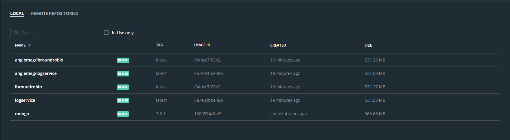
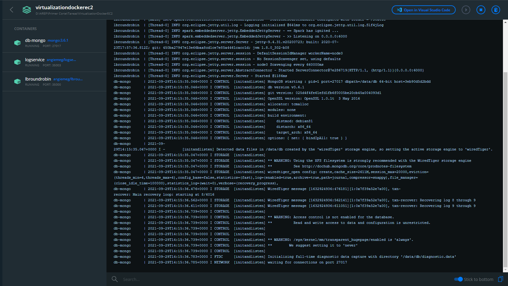
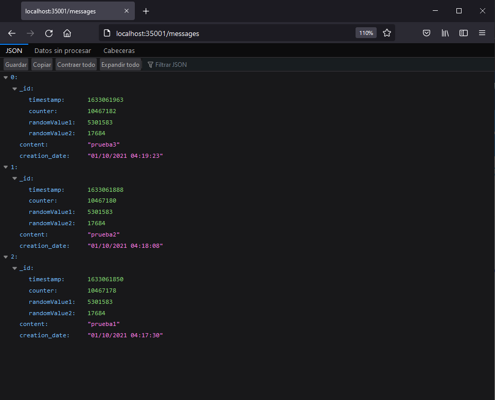
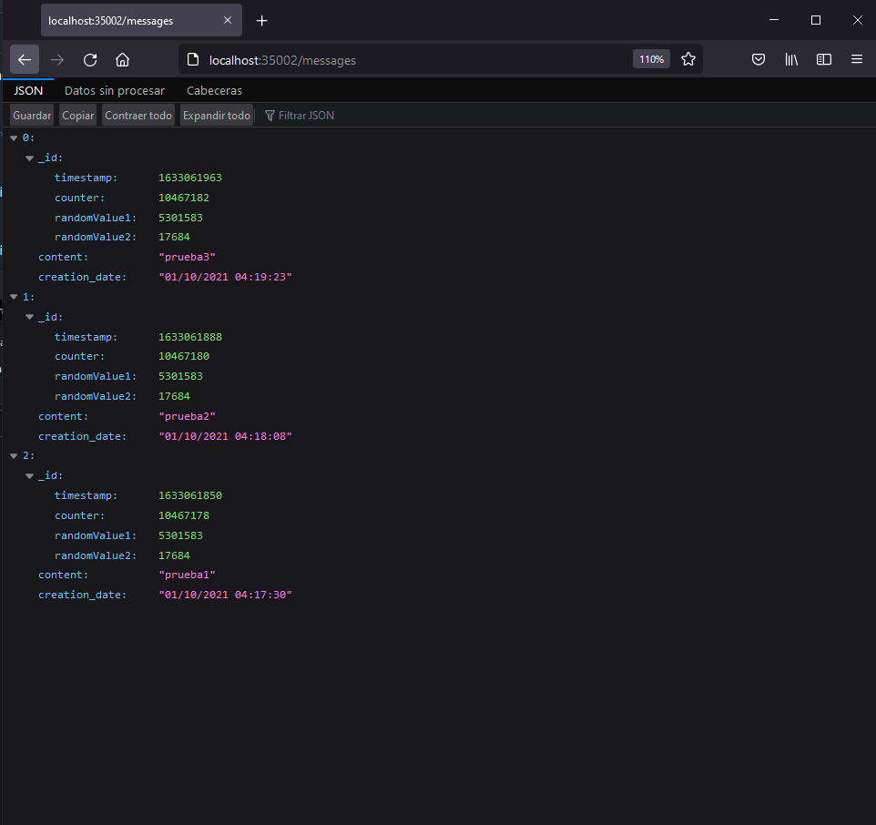
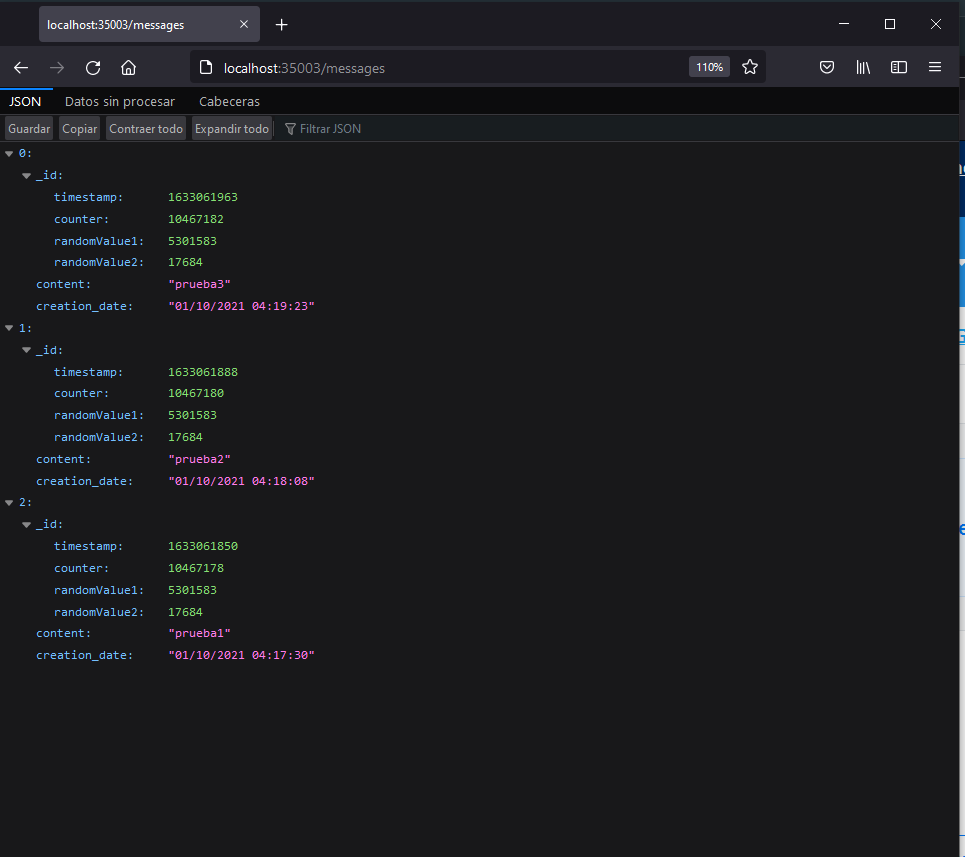
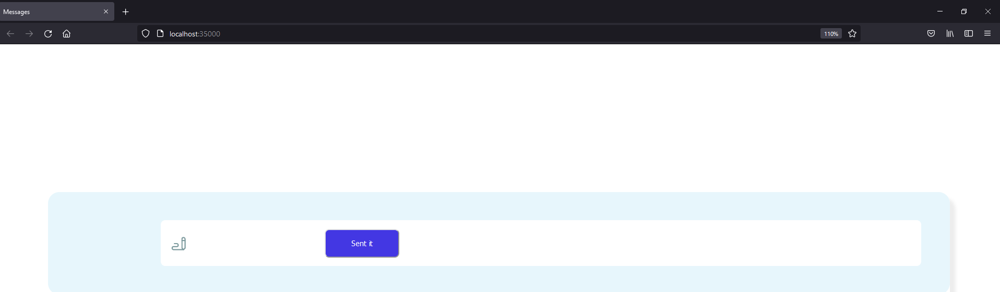
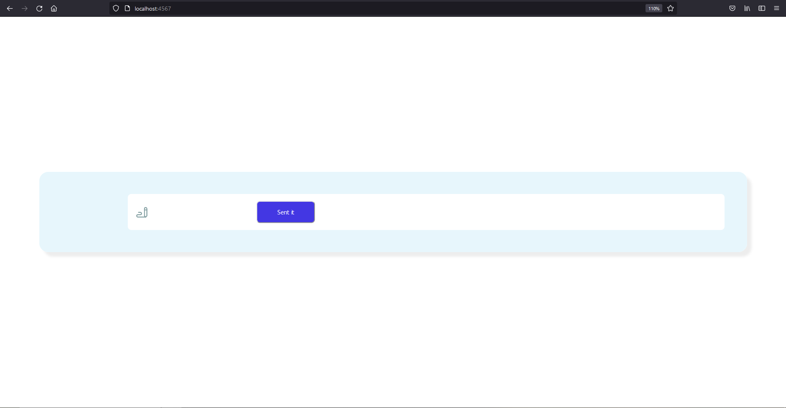
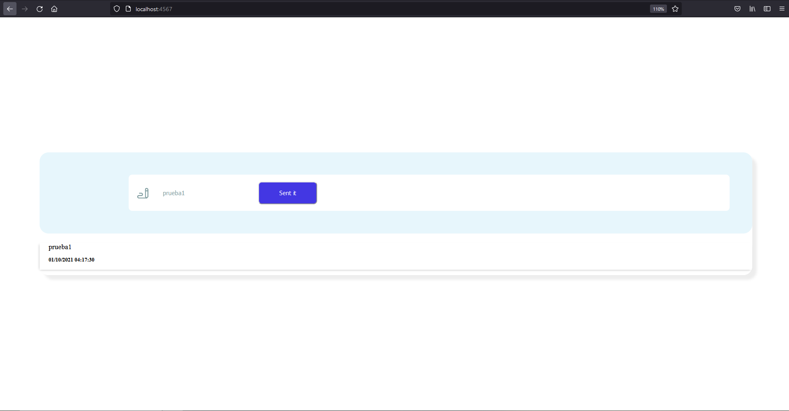
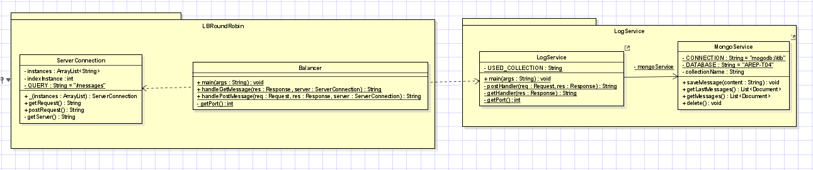
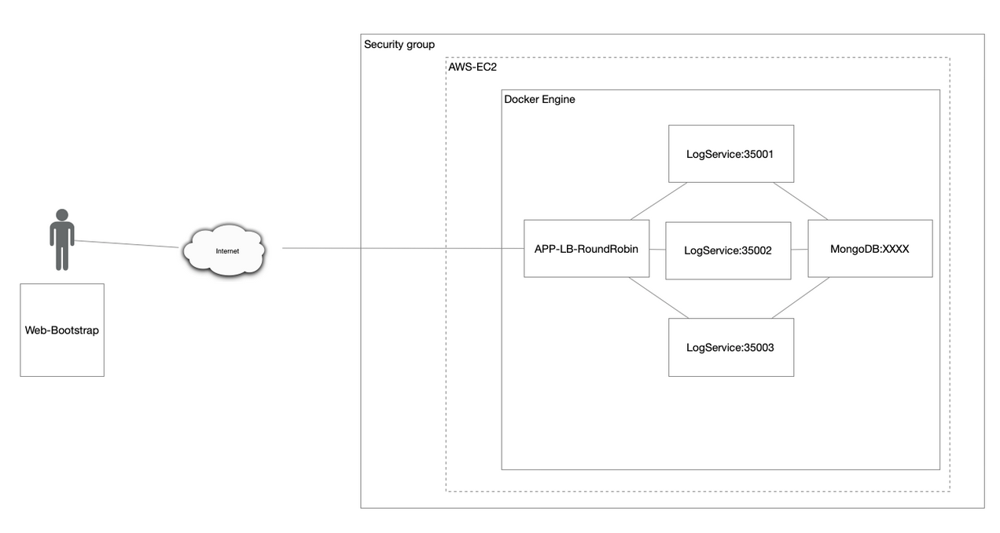

# Taller de de modularización con virtualización e Introducción a Docker y a AWS
El taller consiste en crear una aplicación web pequeña usando el micro-framework de Spark java (http://sparkjava.com/). Una vez tengamos esta aplicación procederemos a construir un container para docker para la aplicación y los desplegaremos y configuraremos en nuestra máquina local. Luego, cerremos un repositorio en DockerHub y subiremos la imagen al repositorio. Finalmente, crearemos una máquina virtual de en AWS, instalaremos Docker , y desplegaremos el contenedor que acabamos de crear.
## Comenzando 🚀

A continuación se presentarán series de instrucciones para que se pueda tener un funcionamiento en maquina local del proyecto

### Pre-requisitos 📋

Para el correcto funcionamiento en un ambiente de desarrollo se deberán tener instaladas las siguientes tecnologías:  
* [Git](https://git-scm.com/) - Software de control de versiones
* [Java 8](https://www.java.com/es/download/ie_manual.jsp) - Entorno de desarrollo
* [Maven](https://maven.apache.org/) - Manejador de dependencias
* [Docker](https://www.docker.com/) - Tecnologia de creación de contenedores Linux


### Instalación 🔧

1. **Clonar el proyecto**
    ```
    git clone https://github.com/AngieMeG/AREP-T04
    ```
2. **Contenedores**
Para la creación de los contenedores se pueden utilizar los siguientes comandos:  
```
docker build --tag logservice .
```
```
docker tag logservice angiemeg/logservice
```
```
docker login
```
```
docker push angiemeg/logservice:latest
```
3. **Docker**
Los contenedores y las imagenes en Docker se deben ver algo asi:



4. **Instancias**  
Se deben tener una instancia de lbroundrobin y tres instancias de logservice





## Ejecución




## Construido con 🛠️
* [Maven](https://maven.apache.org/) - Manejador de dependencias
* [JQuery](https://jquery.com/) - Libreria JavaScript para el manejo del DOM
* [Docker](https://www.docker.com/) - Tecnologia de creación de contenedores Linux

## Arquitectura 🛠️


* Paquete LogService
    * Logservice: Esta clase es un servicio REST el cual maneja los protocolos POST y GET, que recibe una cadena y pasa esta información a la clase MongoService. Corre por el puerto 4568 en local y en docker se tienen 3 instancias que corren en los puertos 35001,35002 y 35003 los cuales estan mapeados al puerto 6001.
    * MongoService: Esta clase recibe una cadena, la guarda en la base de datos con la fecha de creación y responde en un objeto JSON con las 10 ultimas cadenas almacenadas en la base de datos y la fecha en que fueron almacenadas.

* Paquete LBRoundRobin
    * Balancer: está compuesta por un cliente web y al menos un servicio REST. El cliente web tiene un campo y un botón y cada vez que el usuario envía un mensaje, este se lo envía al servicio REST y actualiza la pantalla con la información que este le regresa en formato JSON. Corre por el puerto 4567 en el local y en el docker se tiene una instancia que corre por el puerto 35000 el cual esta mepeado al 6000
    * ServerConnection: Esta clase es la encargada de la conexión con el paquete LogService
## Documentación 📖
Para generar la documentación
```
mvn javadoc:javadoc
```

Haga click [AQUI](./Documentacion/apidocs/index.html) para ver la documentación

## Autores ✒️

* **Angie Tatiana Medina Gil**

## Licencia 📄

Este proyecto está bajo la Licencia GNU General Public License mire el archivo [LICENSE.md](LICENSE.md) para detalles
